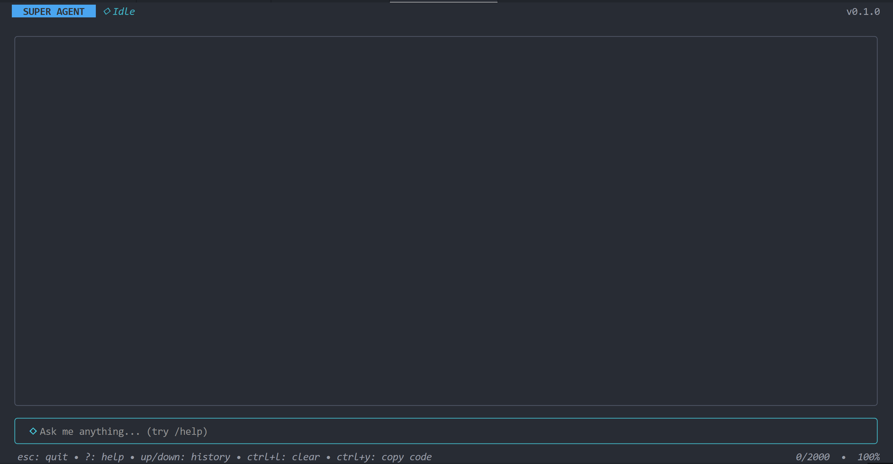

# Super Agent

Go agent runtime with a state-machine core, LLM providers, local tools, and a Bubble Tea TUI.

## Run

- `go run .`: start the TUI. Default provider: DeepSeek.
- `go run . --no-tools`: disable tool calling.
- `go run . --yolo`: allow autonomous tool execution.
- `NO_TOOLS=true go run .`: disable tools by env.
- `YOLO=true go run .`: enable YOLO mode by env.

## Test

- `go test ./...`: run all tests.
- `gofmt -w <files>`: format changed Go files.

## Configuration

`main.go` loads `.env` with `godotenv`.

Provider variables:

- `LLM_PROVIDER`: `deepseek`, `openai`, or `claude`.
- `DEEPSEEK_API_KEY`, `DEEPSEEK_BASE_URL`, `DEEPSEEK_MODEL`.
- `OPENAI_API_KEY`, `OPENAI_BASE_URL`, `OPENAI_MODEL`.
- `ANTHROPIC_API_KEY`, `ANTHROPIC_BASE_URL`, `ANTHROPIC_MODEL`.

DeepSeek uses `DEEPSEEK_API_KEY` and falls back to `OPENAI_API_KEY`.

## Roadmap

- MCP compatibility.
- Skill compatibility.
- System prompt config.
- `AGENTS.md` loading.
- Memory.
- Persistent sessions.
- UI cleanup.
