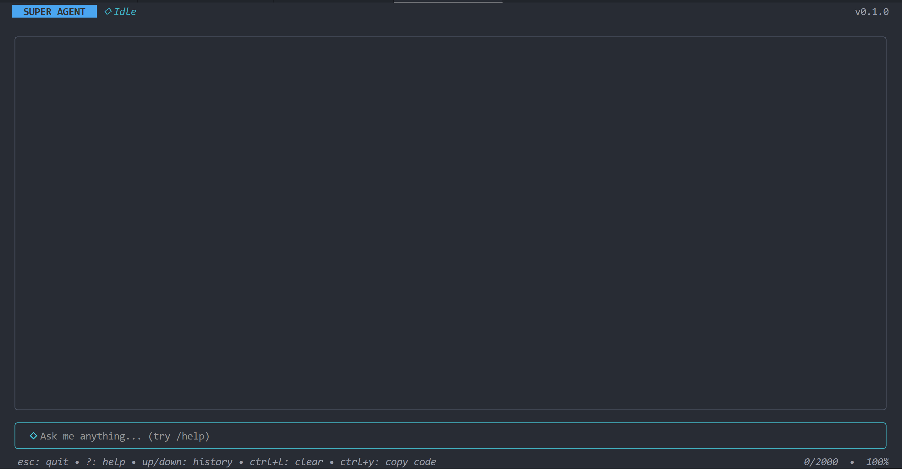

# Super Agent

Go agent runtime with a state-machine core, LLM providers, local tools, and a Bubble Tea TUI.



## Run

- `go run .`: start the TUI. Default provider: DeepSeek.
- `go run . --no-tools`: disable tool calling.
- `go run . --yolo`: allow autonomous tool execution.
- `NO_TOOLS=true go run .`: disable tools by env.
- `YOLO=true go run .`: enable YOLO mode by env.

## Test

- `go test ./...`: run all tests.
- `gofmt -w <files>`: format changed Go files.

## Build

- `./scripts/build-local.sh`: install `/usr/local/bin/super-agent`.

The binary is self-contained and can be run from any working directory. If your
user cannot write `/usr/local/bin`, run the script with `sudo`.

## Configuration

`main.go` loads `.env` with `godotenv`.

`.env` supports runtime switches:

- `NO_TOOLS=true`: disable tools.
- `YOLO=true`: auto-approve tools.

LLM provider config lives in `~/.superagent/settings.json`. On first run, the
app creates this template if the file does not exist:

```json
{
  "provider": "deepseek",
  "providers": {
    "deepseek": {
      "base_url": "https://api.deepseek.com",
      "api_key": "sk-...",
      "model": "deepseek-reasoner"
    },
    "openai": {
      "api_key": "sk-...",
      "model": "gpt-4o"
    },
    "claude": {
      "api_key": "sk-ant-...",
      "model": "claude-3-7-sonnet-20250219"
    }
  }
}
```

The built-in system prompt lives in `app/system_prompt.go` and is compiled into
the binary.

If `AGENTS.md` exists in the working directory, its content is also injected as
system instructions.

## Roadmap

- MCP compatibility.
- Skill compatibility.
- Memory.
- Persistent sessions.
- UI cleanup.
