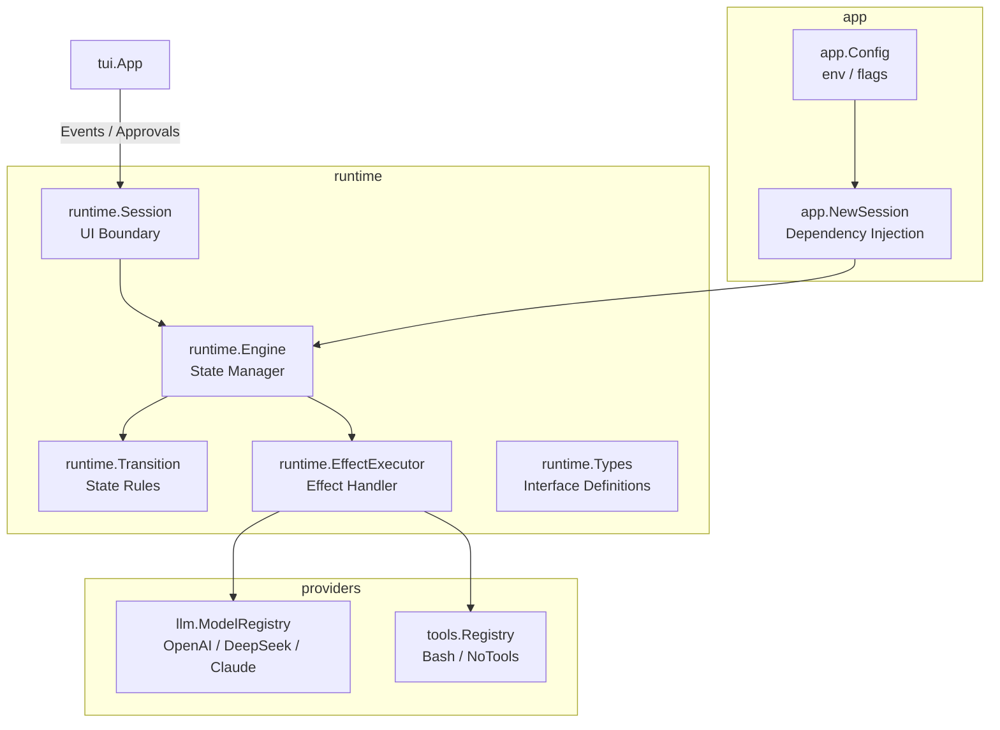
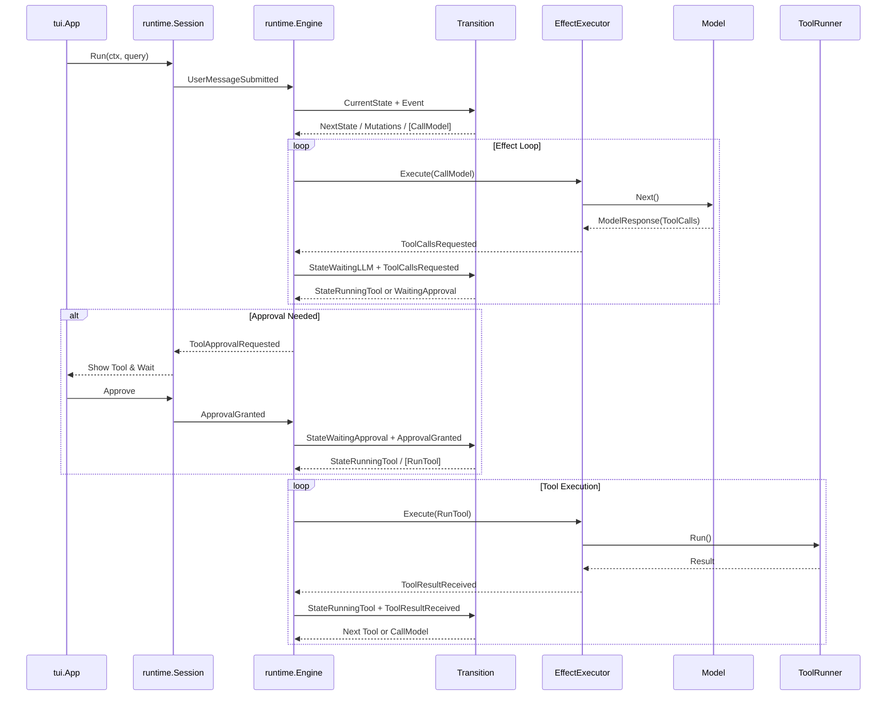

# Arch

目标：把 Agent Runtime 维护成一个可扩展、可测试、边界清楚的状态机。

## Design Model

核心公式：

```text
CurrentState + Event -> NextState / Mutations / Effects
```

- `State`: 描述 Runtime 当前阶段。
- `Event`: 触发状态转移的事实。
- `Mutation`: 同步修改内部上下文的动作，不涉及 IO。
- `Effect`: 外部副作用，如调用模型或执行工具。
- `Transition`: 状态转移规则，纯逻辑决策：检查当前状态和事件，产出下一个状态、Mutations 和 Effects。
- `Engine`: 负责持有上下文、应用 Mutations、并通过 `EffectExecutor` 执行 Effects，将结果转回 Event。

这个模型实现了“决策”与“执行”的解耦，使得状态机核心高度可测试。

## System Architecture



### 关键组件

1. **runtime.Transition**: 纯函数状态机，定义了所有状态转移规则。
2. **runtime.Engine**: 核心控制器，管理当前状态、消息历史和待执行队列。
3. **runtime.EffectExecutor**: 副作用执行器，将抽象的 Effect 转化为具体的操作（如调用模型或工具）。
4. **llm.ModelRegistry**: 模型供应商注册中心，支持动态选择模型（OpenAI, Claude, DeepSeek）。
5. **tools.Registry**: 工具注册中心，支持扩展自定义工具。

## Runtime Flow



## Module Responsibilities

### runtime
核心逻辑包。只定义状态、事件、上下文和核心接口。不依赖具体供应商（LLM）或具体工具实现。

### llm
模型适配层。负责将不同供应商的 API 适配到 `runtime.Model` 接口，处理消息格式转换和流式输出。

### tools
工具实现层。提供 `tools.Registry` 管理所有可用工具。工具通过实现 `tools.Tool` 接口接入系统。

### tui
终端交互层。通过 `runtime.Session` 与核心逻辑交互，只负责展示状态和收集用户反馈（输入、审批）。

### app
组合与配置层。负责解析配置（Env/Flags）、初始化各组件并完成依赖注入（Wiring）。
