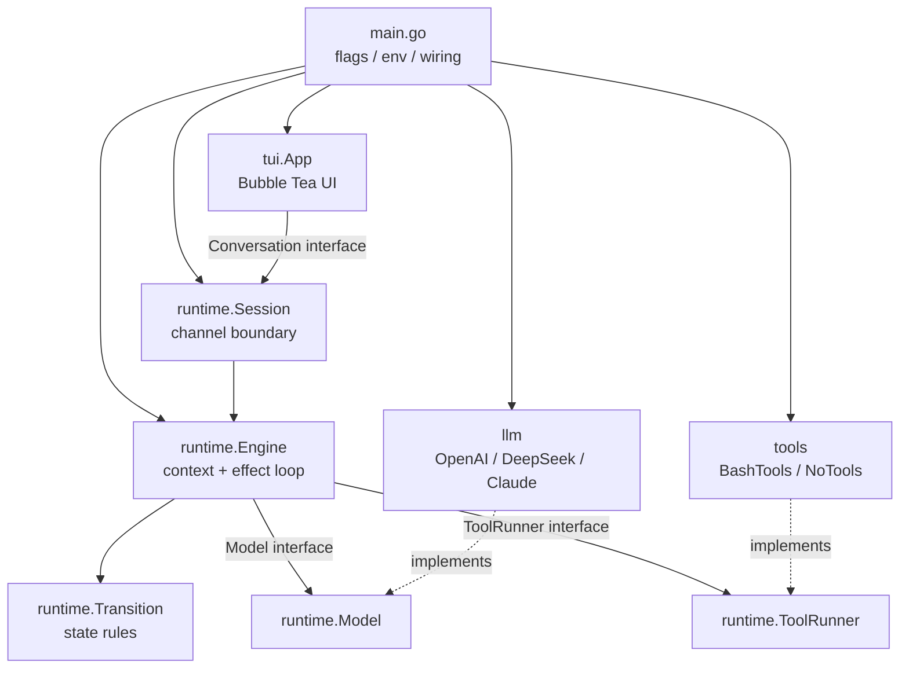
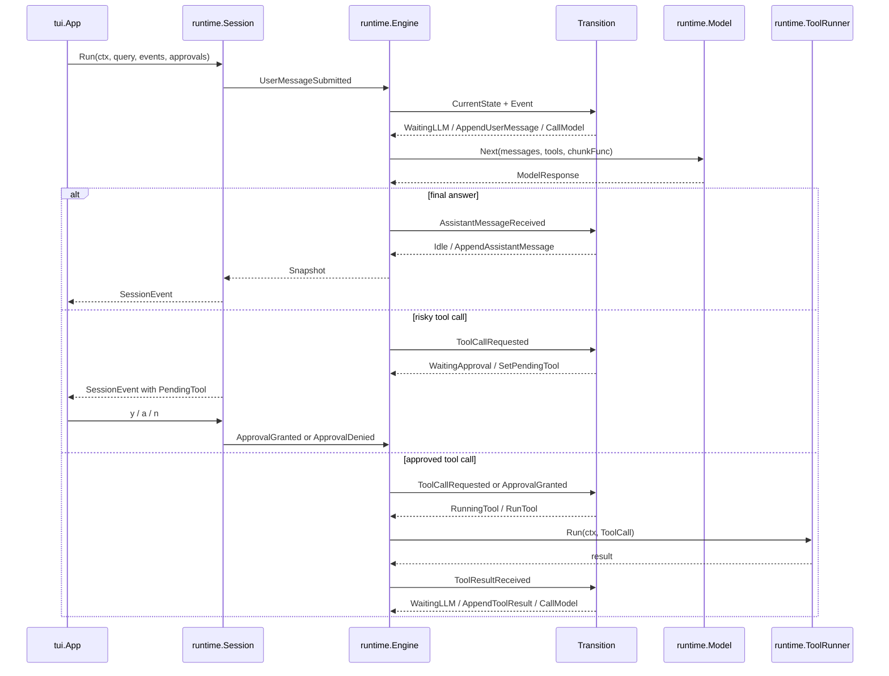
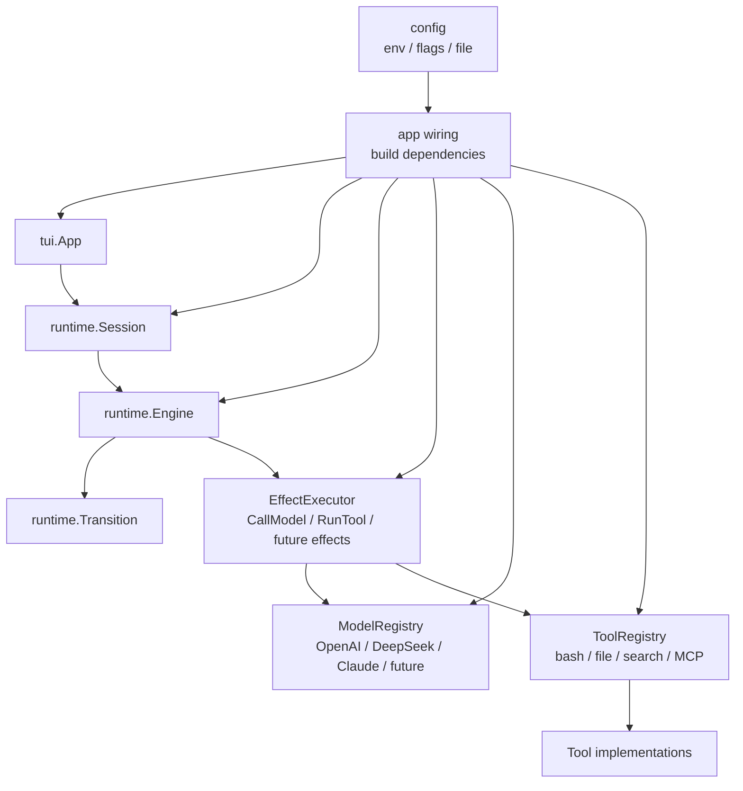

# Arch

目标：把 Agent Runtime 维护成一个可扩展、可测试、边界清楚的状态机。

## Design Model

核心公式：

```text
CurrentState + Event -> NextState / Mutations / Effects
```

- `State` 只描述 Runtime 当前阶段。
- `Event` 是触发状态转移的事实。
- `Mutation` 是同步修改内部上下文的动作，不做 IO。
- `Effect` 是外部副作用，比如调用模型或执行工具。
- `Transition` 只做决策：检查当前状态，产出下一个状态、Mutations、Effects。
- `Engine` 负责持有上下文、应用 Mutations、执行 Effects，并把 Effect 结果重新转成 Event。

这个模型的价值是把“状态转移规则”和“副作用执行”分开。以后加工具、审批策略、模型 provider、trace、memory、planner 时，应该优先扩展边界，而不是把逻辑塞进 TUI 或 provider。

## Current Architecture



当前依赖方向是好的：UI 不直接调用 provider，provider 和 tools 只实现 `runtime` 定义的接口。主要问题在组合层和扩展点还偏硬。

## Runtime Flow



当前状态：

- `Initializing`: 启动中。
- `Idle`: 等用户输入。
- `WaitingLLM`: 模型调用中。
- `WaitingApproval`: 等用户审批 risky tool。
- `RunningTool`: 本地工具执行中。

当前 Event：

- `UserMessageSubmitted`
- `AssistantMessageReceived`
- `ToolCallRequested`
- `ToolResultReceived`
- `ApprovalGranted`
- `ApprovalDenied`
- `ErrorOccurred`
- `CancelRequested`
- `ResetRequested`

当前 Effect：

- `CallModel`
- `RunTool`

## Extensibility Review

### 1. Provider 扩展较顺

`runtime.Model` 把 provider 隔离在接口后面。`llm.OpenAIModel`、DeepSeek config、`ClaudeModel` 都能转成统一的 `runtime.Message` / `ModelResponse`。

风险点：`ModelResponse` 现在只有一个 `ToolCall *ToolCall`。OpenAI 和 Claude 都可能返回多个 tool calls，但当前 OpenAI 只取第一个，Claude 也只保留最后一个。以后要支持并行工具、批量文件读取、多个 MCP tool calls，这里会先卡住。

建议：把 `ModelResponse.ToolCall` 改成 `ToolCalls []ToolCall`，再让 Transition 决定逐个执行、批量审批，或以后并行执行。

### 2. Tool 扩展还不够

`runtime.ToolRunner` 是正确抽象，但 `tools.BashTools` 现在同时负责 specs 和 name 分发。只有一个 bash 工具时没问题；以后加 `read_file`、`write_file`、`search`、MCP tools 时，会变成大 switch。

建议目标：

```text
Tool interface: Spec() ToolSpec + Run(ctx, ToolCall)
ToolRegistry: Register(tool) + Specs() + Run(ctx, call)
```

这样 `Engine` 仍然只依赖 `ToolRunner`，但 tools 包内部可以自然增长。

### 3. Effect 扩展会改 Engine 核心

`Engine.runEffect` 现在直接 switch `CallModel` 和 `RunTool`。以后加 memory、trace、checkpoint、planner、approval policy、external job，都会改 `engine.go`。

建议目标：保留 `Effect` 类型，但增加 `EffectExecutor` 或 effect handler map。`Engine` 只负责 drain queue，具体 effect 执行交给 executor。

### 4. SessionEvent 会变胖

`SessionEvent` 现在是一个带可选字段的结构：`State`、`Chunk`、`Message`、`ToolCall`、`Error`。短期够用，但未来 UI 想显示 tool start/end、token usage、trace id、approval reason、plan step，会继续加字段。

建议目标：把 UI 事件改成 typed union，例如 `StateChanged`、`StreamChunkReceived`、`MessageAppended`、`ToolApprovalRequested`、`ToolStarted`、`ToolFinished`、`RuntimeError`。

### 5. main.go 组合层会膨胀

`main.go` 现在直接读 flags/env，创建 model、tools、engine、session、TUI。以后加 config file、provider registry、tool registry、MCP server、不同入口时，它会变成第二个 runtime。

建议目标：新增 `config` 和 `app wiring` 层：

```text
LoadConfig -> BuildModel -> BuildToolRegistry -> BuildEngine -> BuildUI
```

`main.go` 只负责启动和错误退出。

### 6. Runtime 状态机方向是对的

`Transition` 已经集中表达状态规则，`Mutation` 和 `Effect` 分开，测试可以直接覆盖状态转移。这是后续扩展最应该保留的部分。

注意：不要把审批、provider 特例、工具分发、UI 展示逻辑塞回 `Transition`。`Transition` 应该只看当前 state 和 event。

## Target Extension Shape



这个图是目标形态，不是当前代码。当前代码已经有 `runtime.Model` 和 `runtime.ToolRunner` 两个关键接口；下一步应该先补 `ToolRegistry`，再考虑 `EffectExecutor`。

建议演进顺序：

1. `ModelResponse` 支持 `[]ToolCall`，并补 runtime/llm 测试。
2. 引入 `Tool` 和 `ToolRegistry`，保持 `runtime.ToolRunner` 不变。
3. 把 `main.go` 装配逻辑搬到独立 builder。
4. 如果 Effect 增多，再抽 `EffectExecutor`。
5. 如果 UI 事件继续增加，再拆 `SessionEvent` typed union。

## Module Notes

### runtime

`runtime` 是核心。它应该只拥有状态、事件、上下文、transition、engine、session boundary。它可以定义接口，但不应该 import 具体 provider、具体 tools、Bubble Tea。

### llm

`llm` 只负责 provider 适配。它应该把 provider-specific 消息、reasoning 字段、tool call 格式统一成 `runtime.Message` 和 `runtime.ModelResponse`。

### tools

`tools` 只负责工具实现和工具集合。当前只有 bash 和 no-tools。下一步扩展应先做 registry，不要在 `BashTools.Run` 里继续堆 name switch。

### tui

`tui` 是表现层。它应该继续只依赖 `Conversation`，通过 channel 收事件，通过 approval channel 交互。它不应该知道 provider、tool registry、transition 细节。

### main

`main.go` 是入口，不应该长期承担系统装配复杂度。当前规模可以接受；一旦 tools/provider/config 增多，就应该拆 builder。
