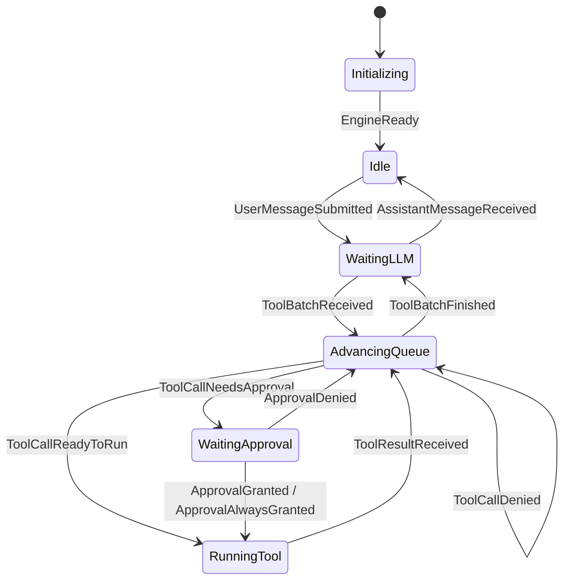

# Machine

`runtime/machine` is the pure domain core: it owns states, events, runtime data, runtime-data
changes, action plans, scheduled actions, and transitions. It performs no I/O, takes no locks, and
never calls a model or a tool.

This file is the **single source of truth for the transition graph**. The table and the diagram below
are both verified against the running machine by `tests/architecture/spec_test.go`; if you change one
without changing `runtime/machine`, that test fails.

## States

`State` is a string-backed type declared in `runtime/machine/state.go`. Six states exist:

| State | Meaning | Entered from | Left by |
|---|---|---|---|
| `Initializing` | Engine constructed, not yet started | engine construction | `EngineReady` |
| `Idle` | No model request, tool call, or approval in flight | initialization, plain reply, cancel, reset, error | `UserMessageSubmitted` |
| `WaitingLLM` | A model call is in flight, including streaming | `UserMessageSubmitted`, tool batch finished | reply, tool batch, cancel, error |
| `AdvancingQueue` | Dispatching the next call in the tool batch | tool batch received, tool result, approval denied | approval needed, runnable call, batch finished |
| `WaitingApproval` | Waiting for the user to decide on a risky call | next call needs approval | grant, always-grant, deny, cancel, error |
| `RunningTool` | One tool call is executing | call needs no approval, or was approved | tool result, cancel, error |

`AdvancingQueue` is a scheduling state; it never executes a tool itself.

## Transition Graph



The diagram deliberately draws **only the state-specific edges**. The global events below are
accepted from any state and are defined in the table only; drawing all 18 of their edges would add
noise without adding information.

## Transition Table

The canonical edge list. `tests/architecture/spec_test.go` enumerates all 6 states ×
`machine.AllEvents` (15 events, 90 pairs) and asserts that the set of accepted pairs with their
`NextState` matches this table exactly — in both directions, so an undocumented edge fails too.

| State | Event | Next | RuntimeDataChanges | ActionPlan |
|---|---|---|---|---|
| Initializing | EngineReady | Idle | - | - |
| Idle | UserMessageSubmitted | WaitingLLM | AppendUserMessage | Schedule CallModel |
| WaitingLLM | AssistantMessageReceived | Idle | AppendAssistantMessage | - |
| WaitingLLM | ToolBatchReceived | AdvancingQueue | AppendAssistantMessage, SetToolCallBatch | Schedule CheckToolQueue |
| WaitingApproval | ApprovalGranted | RunningTool | SetCurrentTool, ClearPendingTool | Schedule RunTool |
| WaitingApproval | ApprovalAlwaysGranted | RunningTool | SetCurrentTool, ClearPendingTool | Schedule RunTool |
| WaitingApproval | ApprovalDenied | AdvancingQueue | ClearPendingTool, AppendToolResult | Schedule CheckToolQueue |
| RunningTool | ToolResultReceived | AdvancingQueue | AppendToolResult, ClearCurrentTool | Schedule CheckToolQueue |
| AdvancingQueue | ToolBatchFinished | WaitingLLM | ClearToolCallBatch | Schedule CallModel |
| AdvancingQueue | ToolCallNeedsApproval | WaitingApproval | SetPendingTool, AdvanceToolCallBatch | Schedule AwaitApproval |
| AdvancingQueue | ToolCallReadyToRun | RunningTool | AdvanceToolCallBatch, SetCurrentTool | Schedule RunTool |
| AdvancingQueue | ToolCallDenied | AdvancingQueue | AdvanceToolCallBatch, AppendToolResult | Schedule CheckToolQueue |
| any | ErrorOccurred | Idle | FlushStreamingAssistant, AppendToolResult, ClearPendingTool, ClearCurrentTool, ClearToolCallBatch | Clear existing |
| any | CancelRequested | Idle | FlushStreamingAssistant, AppendToolResult, ClearPendingTool, ClearCurrentTool, ClearToolCallBatch | Clear existing |
| any | ResetRequested | Idle | ResetConversation | Clear existing |

`any` means every state, `Initializing` and `Idle` included. The `RuntimeDataChanges` column for an
`any` row is a superset sketch, not an exact list: `handleErrorOccurred` and `handleCancelRequested`
append one `AppendToolResult` per outstanding call, so the count varies with the starting state (4
changes from `WaitingLLM`, 5 from `WaitingApproval`, `RunningTool`, or a single-call `AdvancingQueue`
batch). The conformance test therefore pins the edge set and `NextState` only, while
`tests/runtime/transition_test.go` pins the exact change lists per starting state.

Two denial paths exist and they are not the same thing:

- `ApprovalDenied` — the **user** declined, from `WaitingApproval`. Result text is `denied: <tool-name>`.
- `ToolCallDenied` — the **permission policy** declined outright, from `AdvancingQueue`. Result text is
  `denied by permission policy: <reason>`.

Both append the denial as that call's tool result and continue advancing the queue, so the model can
choose another action rather than losing the turn.

`handleErrorOccurred` and `handleCancelRequested` both answer every call the model asked for — the
former with the error reason, the latter with a `cancelled` result. A dispatched call is always in
exactly one of three places — awaiting approval, running, or not yet reached by the batch — so the
outstanding set is the pending call, the current call, and every remaining batch call. Each gets a
tool result. An unanswered tool call produces a transcript the provider rejects with a 400, and
because the transcript is persisted, that failure would survive a resume. Cancelling is therefore
just as bound by this rule as failing; there is no cancel path that leaves a dispatched call
unanswered.

## RuntimeData

`RuntimeData` is the complete mutable machine data (`runtime_data.go`). It is replaced, never mutated
in place.

```go
type RuntimeData struct {
    State              State
    Messages           []Message
    PendingTool        *ToolCall          // awaiting approval
    PendingPermission  *PermissionRequest
    CurrentTool        *ToolCall          // executing
    ToolBatch          *ToolCallBatch     // remaining queue
    StreamingContent   string
    StreamingReasoning string
}
```

## Invariants

`ValidateRuntimeData` (`snapshot.go`) is the authority; these are its rules. `SnapshotFrom` runs it
before every transition, and the `RuntimeDataChangeApplier` runs it again on the cloned candidate, so
an invalid intermediate state can never be committed.

Global:

- Tool batch index is within `[0, len(Calls)]`.
- A pending permission requires a pending tool.
- Streaming content exists only in `WaitingLLM`.

Per state:

| State | Must have | Must not have |
|---|---|---|
| `Initializing`, `Idle`, `WaitingLLM` | — | pending tool, pending permission, current tool, tool batch |
| `AdvancingQueue` | tool batch, index in range | pending tool, pending permission, current tool |
| `WaitingApproval` | batch, pending tool, pending permission; pending tool equals `Calls[Index-1]` | current tool |
| `RunningTool` | batch, current tool; current tool equals `Calls[Index-1]` | pending tool, pending permission |

The `Calls[Index-1]` requirement is why the batch advances *before* a call is dispatched: the call
being approved or run is always the one just consumed.

## Errors

Three error types separate three different mistakes (`errors.go`):

- `UnexpectedEventError` — the current state does not accept this event.
- `ProtocolViolationError` — the event type is valid here, but its content does not match current
  data (a mismatched call ID, a batch that finished before its queue drained, an empty tool batch).
- `InvariantViolationError` — `RuntimeData` itself is impossible.

## RuntimeDataChange

A `RuntimeDataChange` synchronously constructs the next `RuntimeData` from the current one. The
complete vocabulary is `machine.AllRuntimeDataChanges` (`runtime_data_change.go`); the applier
(`runtime_data_change_applier.go`) clones, applies in order, and validates.

Transitions that end a run cannot simply drop work, so they flush and clear explicitly:
`FlushStreamingAssistant`, `ClearPendingTool`, `ClearCurrentTool`, `ClearToolCallBatch`. A transition
that needs to retract queued work sets `ActionPlan.ClearExisting` instead.

`ResetConversation` clears every non-`system` message and preserves all `system` messages. Replay
applies the same rule, so a reset survives a restart while project instructions do not disappear.

## ActionPlan and ScheduledAction

```go
type ActionPlan struct {
    ClearExisting bool
    Schedule      []ScheduledAction
}
```

Clearing obsolete queue work and scheduling new work is one atomic decision, not two. The engine
commits the plan together with the runtime data under a single lock; scheduled actions run only after
that commit.

Four `ScheduledAction` types exist (`scheduled_action.go`, enumerated by `machine.AllScheduledActions`):

| Action | Work |
|---|---|
| `CallModel` | Ask the model, streaming chunks back |
| `RunTool` | Execute one tool call |
| `CheckToolQueue` | Classify the next call in the batch |
| `AwaitApproval` | Wait on the Session-supplied approval port |

Model calls, tool execution, and human approval all travel the same action → result → event path, which
is why approval needs no second loop and no scheduling authority in `runtime/session`.

## Registry

Transitions live in one package-private static registry in `transition.go`, keyed by state and event
kind:

```go
type transitionKey struct {
    state State
    event eventKind
}
```

`registerTransition` panics on a duplicate key, so a new rule cannot silently shadow an old one. The
zero `State` value is not a legal running state, which is how the three global rows are registered
once instead of six times:

```go
{transitionKey{event: eventErrorOccurred}, adaptTransition(handleErrorOccurred)},
```

Lookup tries the exact key first, then the zero-state key, and reports `UnexpectedEventError` if
neither exists.

Handlers take concrete event types, so they cannot be stored in the registry directly.
`adaptTransition[E Event]` unifies the signature, letting the compiler infer `E` from the handler and
recovering the concrete event with a type assertion at call time. The `ok` check is kept so a
mis-registration returns a `ProtocolViolationError` instead of panicking.

Handlers that do not need the snapshot take `_ MachineSnapshot`. Handlers that must relate the event
to current data read it — `handleToolResultReceived` checks that a current tool exists and that the
event's call ID matches it.

## Worked Example: one user message

Take a `UserMessageSubmitted` arriving in `Idle`.

1. **Register** — `transitionKey{StateIdle, eventUserMessageSubmitted}` maps to
   `adaptTransition(handleUserMessageSubmitted)`.
2. **Decide** — the handler returns `NextState: StateWaitingLLM`,
   `RuntimeDataChanges: [AppendUserMessage{...}]`, `ActionPlan{Schedule: [CallModel{}]}`.
   `ClearExisting` stays `false` because nothing needs retracting.
3. **Apply** — `SnapshotFrom` validates the current data, `Transition` produces the decision, the
   applier clones and mutates, `ValidateRuntimeData` checks the candidate, the engine commits data and
   plan together.
4. **Dispatch** — only now does `CallModel` run, via `ScheduledActionRunner` →
   `ScheduledActionExecutor` → `Model.Next`. The engine is already in `WaitingLLM`, so the TUI can show
   the model working.
5. **Continue** — `ActionResultResolver` turns the model result into the next event: a plain reply
   becomes `AssistantMessageReceived` (→ `Idle`), a tool request becomes `ToolBatchReceived`
   (→ `AdvancingQueue` → `CheckToolQueue`).

One user message is therefore not a single state change but the start of a loop driven by events. See
`runtime.md` for the full cycle.

## Terms

- `State`: the current runtime phase.
- `Event`: a fact that triggers a transition.
- `RuntimeData`: the complete mutable machine data.
- `RuntimeDataChange`: a synchronous transformation of cloned `RuntimeData`.
- `ActionPlan`: one queue plan committed together with runtime data; it can clear obsolete work and
  schedule new work.
- `ScheduledAction`: requested work — a model call, tool execution, queue processing, or approval wait.
- `MachineSnapshot`: a validated read-only view exposing only transition guards.
- `Transition`: a pure state-machine decision with state, call, and queue guards.
- `RuntimeDataChangeApplier`: applies runtime-data changes to cloned data and validates the result.
- `ToolCallBatch`: the queued calls of the current batch, with an index marking how far it has advanced.

Engine-side terms — `Engine`, `ActionQueue`, `ActionResultResolver`, `ScheduledActionRunner`,
`RunController`, `ApprovalStore`, `Policy` — are defined in `runtime.md`.

## Adding a Transition

1. Declare the event and its `eventKind` in `runtime/machine/event.go`, and add it to `AllEvents`.
2. Write the handler in `runtime/machine/transition.go`.
3. Register the rule in `newTransitionRegistry`.
4. Return the required `RuntimeDataChanges` and `ActionPlan`.
5. Add the row to the table above — it is the spec, and the conformance test fails without it.
6. Cover the legal path, the rejection path, and the exact output order in
   `tests/runtime/transition_test.go`.
