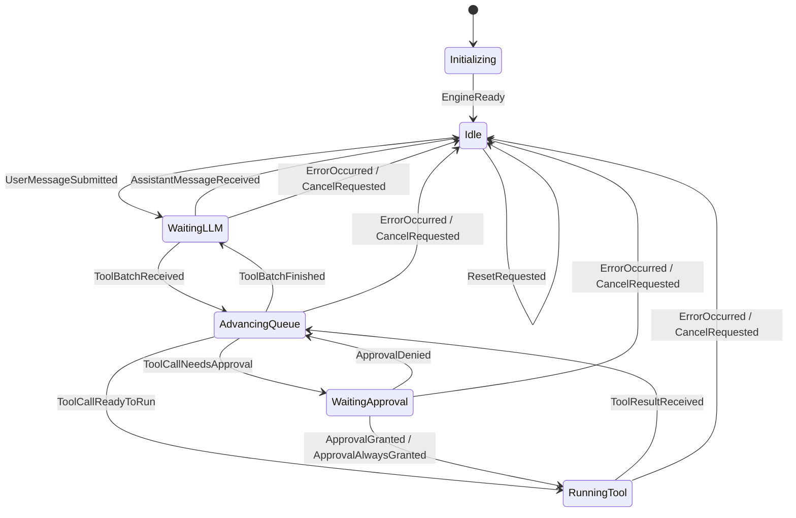

# super-agent 的 state 说明文档


## 6 个状态总览

本项目 agent 的状态机共定义了 6 个状态，位于 `runtime/machine/types.go`
- State 是以 string 为底层类型的自定义类型
- 各状态是 State 类型的字符串常量

- `Initializing`：引擎初始化
  - 状态开始：创建 Engine
  - 状态结束：收到 `EngineReady`

- `Idle`：空闲，等待用户消息
  - 状态开始：初始化完成、模型直接回复、取消、重置或发生错误
  - 状态结束：收到 `UserMessageSubmitted`

- `WaitingLLM`：模型正在处理请求，包括流式输出
  - 状态开始：提交用户消息，或工具批次执行完毕
  - 状态结束：收到模型回复、工具调用批次、取消或错误

- `AdvancingQueue`：推进工具调用队列
  - 状态开始：模型返回工具批次、工具执行完成或审批被拒绝
  - 状态结束：下一项需要审批、可以执行，或整个批次处理完毕

- `WaitingApproval`：等待用户审批工具调用
  - 状态开始：下一项工具调用需要审批
  - 状态结束：用户允许、始终允许、拒绝、取消或发生错误

- `RunningTool`：工具正在执行
  - 状态开始：工具调用无需审批或已获批准
  - 状态结束：工具执行完成、取消或发生错误

全局事件：

- `ErrorOccurred`：进入 `Idle`，清理工具队列与待执行 Effect
- `CancelRequested`：进入 `Idle`，保留已生成内容并清理当前任务
- `ResetRequested`：进入 `Idle`，重置对话上下文


下面这个图展示了不同状态之间的流转，关于状态流转的函数是 `Transition`，位于 `super-agent/runtime/machine/transition.go`


## 第一个状态：`Initializing`

`Initializing` 表示 Engine 已创建，但尚未完成启动。

```go
StateInitializing State = "Initializing"
```

### 进入条件

调用 Engine 构造函数时，初始状态被设置为 `Initializing`：

```go
state: machine.EngineState{
    State:    machine.StateInitializing,
    Messages: messages,
}
```

### 离开条件

调用 `engine.Ready()` 后，Engine 派发 `EngineReady` 事件：

```text
Initializing + EngineReady → Idle
```

`EngineReady` 只能在 `Initializing` 状态处理。其他普通事件会返回 `UnexpectedEventError`。

## 第二个状态：`Idle`

`Idle` 表示 Engine 当前没有正在执行的模型请求、工具调用或审批任务，可以接收用户消息。

```go
StateIdle State = "Idle"
```

### 进入条件

- Engine 初始化完成。
- 模型返回不含工具调用的普通回复。
- 当前任务被取消。
- 发生运行时错误。
- 对话被重置。

主要转移如下：

```text
Initializing + EngineReady             → Idle
WaitingLLM + AssistantMessageReceived  → Idle
任意状态 + ErrorOccurred               → Idle
任意状态 + CancelRequested             → Idle
任意状态 + ResetRequested              → Idle
```

### 离开条件

`Idle` 收到 `UserMessageSubmitted` 后进入 `WaitingLLM`：

```text
Idle + UserMessageSubmitted → WaitingLLM
```

该转移会：

1. 通过 `AppendUserMessage` Mutation 保存用户消息。
2. 将状态改为 `WaitingLLM`。
3. 产生 `CallModel` Effect。

### 状态约束

处于 `Idle` 时，不应存在：

- 待审批工具和权限请求。
- 当前执行的工具。
- 尚未处理完的工具调用批次。

因此，`Idle` 是一次 agent 工作循环的起点，也是正常完成、取消、错误或重置后的落点。

## 第三个状态：`WaitingLLM`

`WaitingLLM` 表示模型调用正在进行。它覆盖等待首个响应、接收流式内容以及等待最终结果的整个过程。

```go
StateWaitingLLM State = "WaitingLLM"
```

### 进入条件

- `Idle` 收到 `UserMessageSubmitted`。
- `AdvancingQueue` 收到 `ToolBatchFinished`。

```text
Idle + UserMessageSubmitted          → WaitingLLM
AdvancingQueue + ToolBatchFinished   → WaitingLLM
```

两条转移都会产生 `CallModel` Effect。区别是第一次把用户消息交给模型，第二次把工具结果交回模型继续推理。

### 流式输出

模型返回的流式片段通过 `AppendStreamingAssistant` Mutation 累积。流式内容只能存在于 `WaitingLLM`。

流式片段不会结束当前状态，只有最终模型结果才会触发下一次状态转移。

### 离开条件

- 返回普通回复：收到 `AssistantMessageReceived`，进入 `Idle`。
- 返回工具调用：收到 `ToolBatchReceived`，进入 `AdvancingQueue`。
- 取消或错误：进入 `Idle`。

```text
WaitingLLM + AssistantMessageReceived → Idle
WaitingLLM + ToolBatchReceived         → AdvancingQueue
WaitingLLM + CancelRequested           → Idle
WaitingLLM + ErrorOccurred             → Idle
```

收到 `ToolBatchReceived` 时，状态机会保存 assistant 消息、建立工具调用批次，并产生 `ProcessNextToolCall` Effect。

## 第四个状态：`AdvancingQueue`

`AdvancingQueue` 表示状态机正在推进工具调用批次，决定下一项工具应该等待审批、直接执行，还是结束整个批次。

```go
StateAdvancingQueue State = "AdvancingQueue"
```

这是一个调度状态，不负责实际执行工具。

### 进入条件

- 模型返回工具调用批次。
- 一个工具执行完成。
- 一个工具调用被拒绝。

```text
WaitingLLM + ToolBatchReceived         → AdvancingQueue
RunningTool + ToolResultReceived       → AdvancingQueue
WaitingApproval + ApprovalDenied       → AdvancingQueue
```

进入后通常会产生 `ProcessNextToolCall` Effect。

### 离开条件

- 下一项需要审批：进入 `WaitingApproval`。
- 下一项可直接执行：进入 `RunningTool`。
- 工具批次已经处理完：进入 `WaitingLLM`，再次调用模型。
- 取消或错误：进入 `Idle`。

```text
AdvancingQueue + ToolCallNeedsApproval → WaitingApproval
AdvancingQueue + ToolCallReadyToRun    → RunningTool
AdvancingQueue + ToolBatchFinished     → WaitingLLM
AdvancingQueue + CancelRequested       → Idle
AdvancingQueue + ErrorOccurred         → Idle
```

### 状态约束

处于 `AdvancingQueue` 时：

- 必须存在工具调用批次。
- 不应存在待审批工具。
- 不应存在当前执行工具。
- 批次索引必须处于合法范围。

## 第五个状态：`WaitingApproval`

`WaitingApproval` 表示下一项工具调用存在风险，需要等待用户决定。

```go
StateWaitingApproval State = "WaitingApproval"
```

### 进入条件

`AdvancingQueue` 收到 `ToolCallNeedsApproval`：

```text
AdvancingQueue + ToolCallNeedsApproval → WaitingApproval
```

该转移会：

1. 保存待审批工具与权限请求。
2. 推进工具批次索引。
3. 暂停 Effect 调度，等待用户输入。

### 离开条件

- 单次允许：进入 `RunningTool`。
- 始终允许：记录授权并进入 `RunningTool`。
- 拒绝：追加拒绝结果并回到 `AdvancingQueue`。
- 取消或错误：进入 `Idle`。

```text
WaitingApproval + ApprovalGranted       → RunningTool
WaitingApproval + ApprovalAlwaysGranted → RunningTool
WaitingApproval + ApprovalDenied        → AdvancingQueue
WaitingApproval + CancelRequested       → Idle
WaitingApproval + ErrorOccurred         → Idle
```

### 状态约束

处于 `WaitingApproval` 时，必须同时存在：

- 工具调用批次。
- 待审批工具。
- 对应的权限请求。

待审批工具必须与工具批次中刚刚推进的调用一致。

## 第六个状态：`RunningTool`

`RunningTool` 表示一个工具调用正在执行。

```go
StateRunningTool State = "RunningTool"
```

### 进入条件

- 工具无需审批，可以直接执行。
- 用户批准当前工具调用。
- 用户批准并将当前工具加入长期允许列表。

```text
AdvancingQueue + ToolCallReadyToRun       → RunningTool
WaitingApproval + ApprovalGranted         → RunningTool
WaitingApproval + ApprovalAlwaysGranted   → RunningTool
```

进入该状态时，状态机会保存当前工具，并产生 `RunTool` Effect。

### 离开条件

- 工具返回结果：进入 `AdvancingQueue`，继续处理批次。
- 取消或错误：进入 `Idle`。

```text
RunningTool + ToolResultReceived → AdvancingQueue
RunningTool + CancelRequested    → Idle
RunningTool + ErrorOccurred      → Idle
```

收到工具结果时，状态机会：

1. 通过 `AppendToolResult` 保存结果。
2. 清除当前工具。
3. 产生 `ProcessNextToolCall` Effect。

### 状态约束

处于 `RunningTool` 时：

- 必须存在工具调用批次。
- 必须存在当前执行工具。
- 当前工具必须与批次中刚刚推进的调用一致。
- 不应同时存在待审批工具或权限请求。
