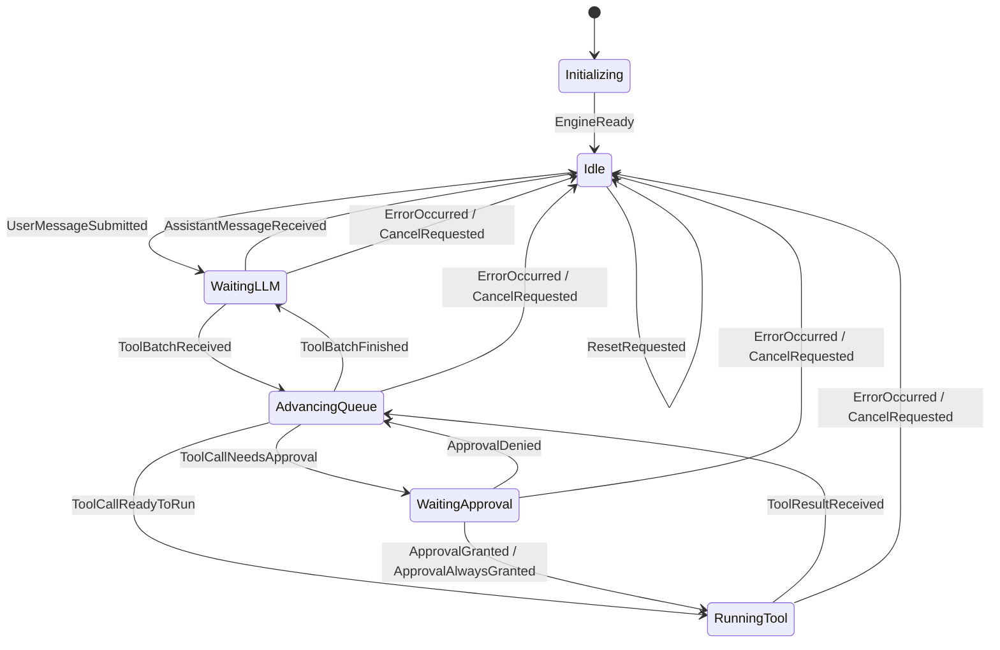

# super-agent 的 state 说明文档


## 6 个状态总览

本项目 agent 的状态机共定义了 6 个状态，位于 `runtime/machine/types.go`
- State 是以 string 为底层类型的自定义类型
- 各状态是 State 类型的字符串常量

- `Initializing`：引擎初始化
  - 状态开始：创建 Engine
  - 状态结束：收到 `EngineReady`

- `Idle`：空闲，等待用户消息
  - 状态开始：初始化完成、模型直接回复、取消、重置或发生错误
  - 状态结束：收到 `UserMessageSubmitted`

- `RunningModel`：模型正在生成响应，包括流式输出
  - 状态开始：提交用户消息，或工具批次执行完毕
  - 状态结束：收到模型回复、工具调用批次、取消或错误

- `AdvancingQueue`：推进工具调用队列
  - 状态开始：模型返回工具批次、工具执行完成或审批被拒绝
  - 状态结束：下一项需要审批、可以执行，或整个批次处理完毕

- `WaitingApproval`：等待用户审批工具调用
  - 状态开始：下一项工具调用需要审批
  - 状态结束：用户允许、始终允许、拒绝、取消或发生错误

- `RunningTool`：工具正在执行
  - 状态开始：工具调用无需审批或已获批准
  - 状态结束：工具执行完成、取消或发生错误

全局事件：

- `ErrorOccurred`：进入 `Idle`，清理工具队列与待执行 Effect
- `CancelRequested`：进入 `Idle`，保留已生成内容并清理当前任务
- `ResetRequested`：进入 `Idle`，重置对话上下文


下面这个图展示了不同状态之间的流转


## 第一个状态：`Initializing`

`Initializing` 表示 Engine 已创建，但尚未完成启动。

```go
StateInitializing State = "Initializing"
```

### 进入条件

调用 Engine 构造函数时，初始状态被设置为 `Initializing`：

```go
state: machine.EngineState{
    State:    machine.StateInitializing,
    Messages: messages,
}
```

### 离开条件

调用 `engine.Ready()` 后，Engine 派发 `EngineReady` 事件：

```text
Initializing + EngineReady → Idle
```

`EngineReady` 只能在 `Initializing` 状态处理。其他普通事件会返回 `UnexpectedEventError`。

## 第二个状态：`Idle`

`Idle` 表示 Engine 当前没有正在执行的模型请求、工具调用或审批任务，可以接收用户消息。

```go
StateIdle State = "Idle"
```

### 进入条件

- Engine 初始化完成。
- 模型返回不含工具调用的普通回复。
- 当前任务被取消。
- 发生运行时错误。
- 对话被重置。

主要转移如下：

```text
Initializing + EngineReady             → Idle
WaitingLLM + AssistantMessageReceived  → Idle
任意状态 + ErrorOccurred               → Idle
任意状态 + CancelRequested             → Idle
任意状态 + ResetRequested              → Idle
```

### 离开条件

`Idle` 收到 `UserMessageSubmitted` 后进入 `WaitingLLM`：

```text
Idle + UserMessageSubmitted → WaitingLLM
```

该转移会：

1. 通过 `AppendUserMessage` Mutation 保存用户消息。
2. 将状态改为 `WaitingLLM`。
3. 产生 `CallModel` Effect。

### 状态约束

处于 `Idle` 时，不应存在：

- 待审批工具和权限请求。
- 当前执行的工具。
- 尚未处理完的工具调用批次。

因此，`Idle` 是一次 agent 工作循环的起点，也是正常完成、取消、错误或重置后的落点。
